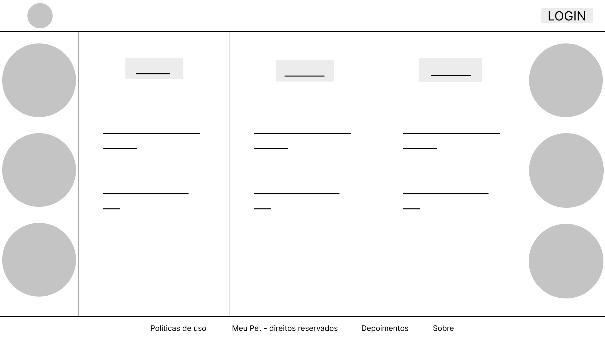
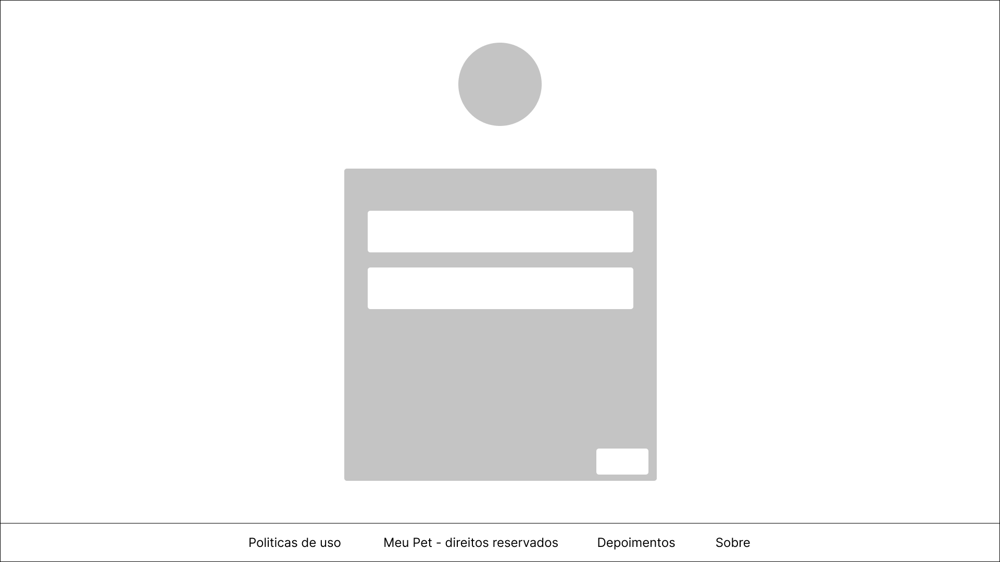
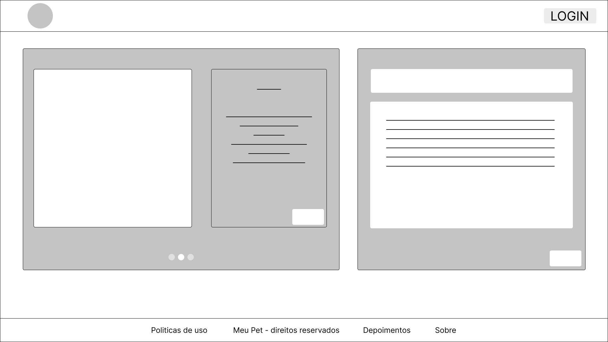
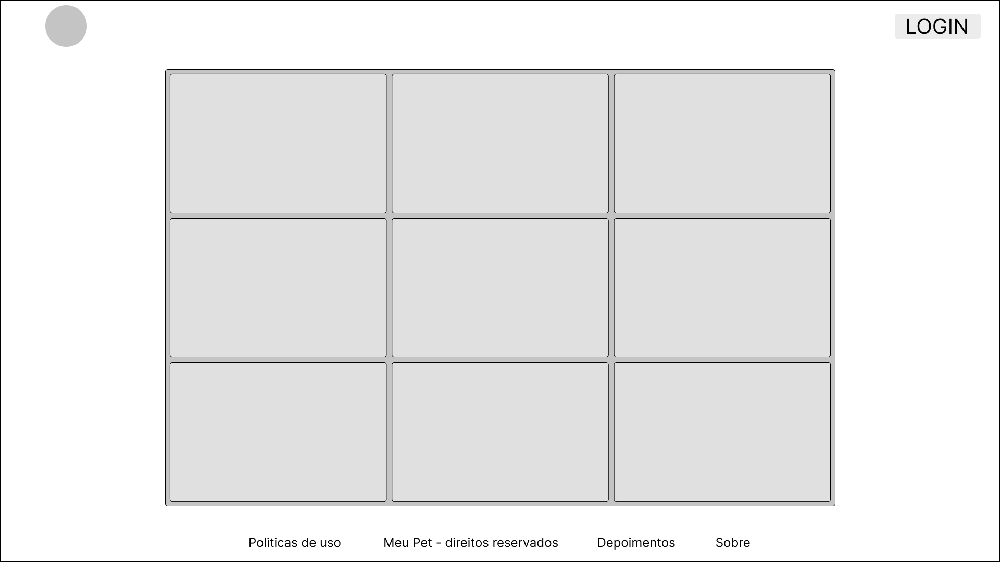

# Informações do Projeto
`TÍTULO DO PROJETO`  

Projeto Meu Pet

`CURSO` 

Trabalho Interdisciplinar: aplicacoes web

## Participantes

- Joao Vaz
- Isabela Braga
- Gustavo Lopes

# Estrutura do Documento

- [Informações do Projeto](#informações-do-projeto)
  - [Participantes](#participantes)
- [Estrutura do Documento](#estrutura-do-documento)
- [Introdução](#introdução)
  - [Problema](#problema)
  - [Objetivos](#objetivos)
  - [Justificativa](#justificativa)
  - [Público-Alvo](#público-alvo)
- [Especificações do Projeto](#especificações-do-projeto)
  - [Personas, Empatia e Proposta de Valor](#personas-empatia-e-proposta-de-valor)
  - [Histórias de Usuários](#histórias-de-usuários)
  - [Requisitos](#requisitos)
    - [Requisitos Funcionais](#requisitos-funcionais)
    - [Requisitos não Funcionais](#requisitos-não-funcionais)
  - [Restrições](#restrições)
- [Projeto de Interface](#projeto-de-interface)
  - [User Flow](#user-flow)
  - [Wireframes](#wireframes)
- [Metodologia](#metodologia)
  - [Divisão de Papéis](#divisão-de-papéis)
  - [Ferramentas](#ferramentas)
  - [Controle de Versão](#controle-de-versão)
- [**############## SPRINT 1 ACABA AQUI #############**](#-sprint-1-acaba-aqui-)
- [Projeto da Solução](#projeto-da-solução)
  - [Tecnologias Utilizadas](#tecnologias-utilizadas)
  - [Arquitetura da solução](#arquitetura-da-solução)
- [Avaliação da Aplicação](#avaliação-da-aplicação)
  - [Plano de Testes](#plano-de-testes)
  - [Ferramentas de Testes (Opcional)](#ferramentas-de-testes-opcional)
  - [Registros de Testes](#registros-de-testes)
- [Referências](#referências)

# Introdução

## Problema

O projeto Meu Pet foi desenvolvido tendo em mente os entraves presentes na vida de muitos “pais de pet”. Em específico, procuramos, com a plataforma, resolver três principais problemas: como procurar um animal de estimação que fugiu; como colocar pessoas dispostas a adotar pets em contato com individuos que desejam colocar pets em adoção; e como encontrar treinadores de animais, dignos de confiança, de forma a estimular o bom-comportamento do pet.

## Objetivos

O propósito central do nosso projeto é criar um software que possa proporcionar auxílio a pessoas envolvidas de alguma maneira com animais de estimação. Especificamente, buscamos desenvolver uma ferramenta que ofereça suporte a indivíduos interessados em adotar pets, aqueles que encontraram um animal abandonado nas ruas ou que precisam de assistência profissional no comportamento de seus animais de estimação.

## Justificativa

Nossa motivação para trabalhar com o tema pets foi ter em vista que hoje em dia existem cerca de 87 milhões de animais de companhia no Brasil, ou seja, é um tema muito atual e frequente no nosso país. A função do nosso projeto, tendo em vista que nosso público alvo são pessoas envolvidas com animais de estimação, é apresentar ferramentas para auxiliar milhões de brasileiros que de alguma forma enfrentam algum problema, seja em relação ao comportamento do pet, ou tem problemas com adoção, ou em relação a animais que fugiram. 
>

## Público-Alvo

Pessoas de todas as idades que, por serem envolvidos de alguma forma com animais de estimação, desejam buscar, adotar, ou adestrá-los. Moram no Brasil e têm muita relação com a internet, onde iram se informar no nosso software. 
>
 
# Especificações do Projeto

Nesta parte do documento, abordaremos personas, propostas de valor e empatia trabalhadas com o auxílio da plataforma Miro.

## Personas, Empatia e Proposta de Valor

- Aline Gomes: 24 anos
  - Sobre ela:
    - Jornalista
    - Gosta de pintura
  - Objetivos:
    - Achar seu pet que fugiu
  - Desafios:
    - Não sabe por onde começar a procurar
  - Como posso ajudá-la:
    - Ajudar na divulgação do pet perdido.
  - Produtos e serviços: Divulgação de animais de estimação que fugiram.
  - Criadores de ganhos: Oportunidades de encontrar o pet.
  - Analgésicos: Melhor conexão entre pessoas.
  - Ganhos: Em virtude do uso do site, o usuário conseguirá encontrar o que está procurando.
  - Dores: Preocupação se irá achar seu animal.
  - Tarefas do cliente: Divulgar fotos do pet no site

- Paula Assis: 28 anos
  - Sobre:
    - Enfermeira
    - Ama fotografia
  - Objetivos:
    - Achar alguém que queira adotar seu animal de estimação.
  - Desafios:
    - Encontrar uma pessoa confiável que cuide bem dos animais.
  - Como posso ajudá-la:
    - Divulgando em nosso site fotos dos animais de Paula para que alguém que queira adotar possa encontrá-los.
  - Produtos e serviços: Divulgação de animais de estimação para adoção.
  - Criadores de ganhos: Oportunidades de encontrar um pet para você.
  - Analgésicos: Melhor conexão entre pessoas.
  - Ganhos: Em virtude do uso do site, o usuário conseguirá encontrar o que está procurando.
  - Dores: Vontade de colocar para adoção um pet.
  - Tarefas do cliente: Divulgar fotos do pet no site para que alguém interessado nele possa vê-lo.

- Lucas Figueiredo: 18 anos
  - Sobre:
    - Estudante
    - Gosta de surfar
  - Objetivos:
    - Precisa de ajuda com o comportamento do seu pet.
  - Desafios:
    - Não entende nada sobre adestramento de cães.
  - Como posso ajudá-lo:
    - Disponibilizando em nosso site dicas de adestramento, e contatos de profissionais na área.
  - Produtos e serviços: Divulgação de serviços de adestramento.
  - Criadores de ganhos: Oportunidades de melhorar o comportamento do pet.
  - Analgésicos: Melhor conexão entre pessoas.
  - Ganhos: Em virtude do uso do site, o usuário conseguirá encontrar o que está procurando.
  - Dores: Preocupação se irá achar alguém qualificado.
  - Tarefas do cliente: Procurar o contato de adestradores no site.

## Histórias de Usuários

Com base na análise das personas foram identificadas as seguintes histórias de usuários:

|EU COMO... `PERSONA`| QUERO/PRECISO ... `FUNCIONALIDADE` |PARA ... `MOTIVO/VALOR`                 |
|--------------------|------------------------------------|----------------------------------------|
|Aline Gomes       | Achar meu pet               | Dedicar a ele o carinho que merece |
|Paula Assis       | Encontrar pais adotivos para o meu pet                 | Que ele receba o cuidado e a atenção que merece |
|Lucas Figueiredo       | Treinar meu pet                | Que ele não ataque pessoas na rua |

## Requisitos

As tabelas que se seguem apresentam os requisitos funcionais e não funcionais que detalham o escopo do projeto.

### Requisitos Funcionais

|ID    | Descrição do Requisito  | Prioridade |
|------|-----------------------------------------|----|
|RF-001| Encontrar um animal | ALTA | 
|RF-002| Colocar animais em adoção   | MÉDIA |
|RF-003| Colocar pais de pet e treinadores em contato   | BAIXA |

### Requisitos não Funcionais

|ID     | Descrição do Requisito  |Prioridade |
|-------|-------------------------|----|
|RNF-001| Conexão com a internet |  ALTA |
|RNF-002| O sistema deve ser responsivo para rodar em um dispositivos móvel | MÉDIA |
|RNF-003| Acesso a tecnologia |  BAIXA |

## Restrições

O projeto está restrito pelos itens apresentados na tabela a seguir.

|ID| Restrição                                             |
|--|-------------------------------------------------------|
|01| O projeto deverá ser entregue até o final do semestre |
|02| Não pode ser desenvolvido um módulo de backend        |
|03| A plataforma fará uso apenas de ferramentas aprendidas em sala de aula |

# Projeto de Interface

A plataforma foi elaborada inteiramente de forma a solucionar os entraves encontrados pelos nossos usuários. A tela de login, por exemplo, é limpa e minimalista - aos moldes do _state of the art_ dos dias atuais. Além disso, a logica por trás da função de busca por pets fugidos agrupa os animais em ordem cronológica - o que aumenta as chances do usuário ajudar na busca pelo pet. Por fim, a tela de treinamento, que associa donos de pets a treinadores locais, não só apresenta diversos profissionais, como tambem uma breve descrição de cada um; permitindo ao usuario escolher a pessoa cujas características mais se encaixem nos seus gostos e necessidades pessoais.

## User Flow

......  INCLUA AQUI O DIAGRAMA COM O FLUXO DO USUÁRIO NA APLICAÇÃO ......

> Fluxo de usuário (User Flow) é uma técnica que permite ao desenvolvedor
> mapear todo fluxo de telas do site ou app. Essa técnica funciona
> para alinhar os caminhos e as possíveis ações que o usuário pode
> fazer junto com os membros de sua equipe.
>
> **Links Úteis**:
> - [User Flow: O Quê É e Como Fazer?](https://medium.com/7bits/fluxo-de-usu%C3%A1rio-user-flow-o-que-%C3%A9-como-fazer-79d965872534)
> - [User Flow vs Site Maps](http://designr.com.br/sitemap-e-user-flow-quais-as-diferencas-e-quando-usar-cada-um/)
> - [Top 25 User Flow Tools & Templates for Smooth](https://www.mockplus.com/blog/post/user-flow-tools)
>
> **Exemplo**:
> 
> 

## Wireframes

# Metodologia

Na construcao da plataforma, utilizamos diversos _workflows_ que nos permitiram atingir nosso objetivo tecnico. Entre eles, destacam-se o GitHub (_version control software_), o Figma (para _design_), o Visual Studio Code (para a edicao de codigo) e o Miro (_brainstorming_ e definicao de prioridades e de funcionalidades). Somado a isso, fizemos uso das metodologias ageis, de forma de aumentar a eficiencia da Equipe, e de tecnologias de comunicacao em tempo real, como o Discord e o Whatsapp; que visaram a(com crase) manutencao da sinergia do time.

> Nesta parte do documento, você deve apresentar a metodologia 
> adotada pelo grupo, descrevendo o processo de trabalho baseado nas metodologias ágeis, 
> a divisão de papéis e tarefas, as ferramentas empregadas e como foi realizada a
> gestão de configuração do projeto via GitHub.
>
> Coloque detalhes sobre o processo de Design Thinking e a implementação do Framework Scrum seguido
> pelo grupo. O grupo poderá fazer uso de ferramentas on-line para acompanhar
> o andamento do projeto, a execução das tarefas e o status de desenvolvimento
> da solução.
> 
> **Links Úteis**:
> - [Tutorial Trello](https://trello.com/b/8AygzjUA/tutorial-trello)
> - [Gestão ágil de projetos com o Trello](https://www.youtube.com/watch?v=1o9BOMAKBRE)
> - [Gerência de projetos - Trello com Scrum](https://www.youtube.com/watch?v=DHLA8X_ujwo)
> - [Tutorial Slack](https://slack.com/intl/en-br/)

## Divisão de Papéis

......  COLOQUE AQUI O SEU TEXTO ......

> Apresente a divisão de papéis e tarefas entre os membros do grupo.
>
> **Links Úteis**:
> - [11 Passos Essenciais para Implantar Scrum no seu Projeto](https://mindmaster.com.br/scrum-11-passos/)
> - [Scrum em 9 minutos](https://www.youtube.com/watch?v=XfvQWnRgxG0)

## Ferramentas

......  COLOQUE AQUI O SEU TEXTO - SIGA O EXEMPLO DA TABELA ABAIXO  ......

| Ambiente  | Plataforma              |Link de Acesso |
|-----------|-------------------------|---------------|
|Processo de Design Thinkgin  | Miro |  https://miro.com/XXXXXXX | 
|Repositório de código | GitHub | https://github.com/XXXXXXX | 
|Hospedagem do site | Heroku |  https://XXXXXXX.herokuapp.com | 
|Protótipo Interativo | MavelApp ou Figma | https://figma.com/XXXXXXX | 

>
> Liste as ferramentas empregadas no desenvolvimento do
> projeto, justificando a escolha delas, sempre que possível.
> 
> As ferramentas empregadas no projeto são:
> 
> - Editor de código.
> - Ferramentas de comunicação
> - Ferramentas de diagramação
> - Plataforma de hospedagem
> 
> O editor de código foi escolhido porque ele possui uma integração com o
> sistema de versão. As ferramentas de comunicação utilizadas possuem
> integração semelhante e por isso foram selecionadas. Por fim, para criar
> diagramas utilizamos essa ferramenta por melhor captar as
> necessidades da nossa solução.
> 
> **Links Úteis - Hospedagem**:
> - [Getting Started with Heroku](https://devcenter.heroku.com/start)
> - [Crie seu Site com o HostGator](https://www.hostgator.com.br/como-publicar-seu-site)
> - [GoDady](https://br.godaddy.com/how-to)
> - [GitHub Pages](https://pages.github.com/)

## Controle de Versão

......  COLOQUE AQUI O SEU TEXTO ......

> Discuta como a configuração do projeto foi feita na ferramenta de
> versionamento escolhida. Exponha como a gerência de tags, merges,
> commits e branchs é realizada. Discuta como a gerência de issues foi
> realizada.
> A ferramenta de controle de versão adotada no projeto foi o
> [Git](https://git-scm.com/), sendo que o [Github](https://github.com)
> foi utilizado para hospedagem do repositório `upstream`.
> 
> O projeto segue a seguinte convenção para o nome de branchs:
> 
> - `master`: versão estável já testada do software
> - `unstable`: versão já testada do software, porém instável
> - `testing`: versão em testes do software
> - `dev`: versão de desenvolvimento do software
> 
> Quanto à gerência de issues, o projeto adota a seguinte convenção para
> etiquetas:
> 
> - `bugfix`: uma funcionalidade encontra-se com problemas
> - `enhancement`: uma funcionalidade precisa ser melhorada
> - `feature`: uma nova funcionalidade precisa ser introduzida
>
> **Links Úteis**:
> - [Tutorial GitHub](https://guides.github.com/activities/hello-world/)
> - [Git e Github](https://www.youtube.com/playlist?list=PLHz_AreHm4dm7ZULPAmadvNhH6vk9oNZA)
> - [5 Git Workflows & Branching Strategy to deliver better code](https://zepel.io/blog/5-git-workflows-to-improve-development/)
>
> **Exemplo - GitHub Feature Branch Workflow**:
>
> 

# **############## SPRINT 1 ACABA AQUI #############**

# Projeto da Solução

......  COLOQUE AQUI O SEU TEXTO ......

## Tecnologias Utilizadas

......  COLOQUE AQUI O SEU TEXTO ......

> Descreva aqui qual(is) tecnologias você vai usar para resolver o seu
> problema, ou seja, implementar a sua solução. Liste todas as
> tecnologias envolvidas, linguagens a serem utilizadas, serviços web,
> frameworks, bibliotecas, IDEs de desenvolvimento, e ferramentas.
> Apresente também uma figura explicando como as tecnologias estão
> relacionadas ou como uma interação do usuário com o sistema vai ser
> conduzida, por onde ela passa até retornar uma resposta ao usuário.
> 
> Inclua os diagramas de User Flow, esboços criados pelo grupo
> (stoyboards), além dos protótipos de telas (wireframes). Descreva cada
> item textualmente comentando e complementando o que está apresentado
> nas imagens.

## Arquitetura da solução

......  COLOQUE AQUI O SEU TEXTO E O DIAGRAMA DE ARQUITETURA .......

> Inclua um diagrama da solução e descreva os módulos e as tecnologias
> que fazem parte da solução. Discorra sobre o diagrama.
> 
> **Exemplo do diagrama de Arquitetura**:
> 
> 

# Avaliação da Aplicação

......  COLOQUE AQUI O SEU TEXTO ......

> Apresente os cenários de testes utilizados na realização dos testes da
> sua aplicação. Escolha cenários de testes que demonstrem os requisitos
> sendo satisfeitos.

## Plano de Testes

......  COLOQUE AQUI O SEU TEXTO ......

> Enumere quais cenários de testes foram selecionados para teste. Neste
> tópico o grupo deve detalhar quais funcionalidades avaliadas, o grupo
> de usuários que foi escolhido para participar do teste e as
> ferramentas utilizadas.
> 
> **Links Úteis**:
> - [IBM - Criação e Geração de Planos de Teste](https://www.ibm.com/developerworks/br/local/rational/criacao_geracao_planos_testes_software/index.html)
> - [Práticas e Técnicas de Testes Ágeis](http://assiste.serpro.gov.br/serproagil/Apresenta/slides.pdf)
> -  [Teste de Software: Conceitos e tipos de testes](https://blog.onedaytesting.com.br/teste-de-software/)

## Ferramentas de Testes (Opcional)

......  COLOQUE AQUI O SEU TEXTO ......

> Comente sobre as ferramentas de testes utilizadas.
> 
> **Links Úteis**:
> - [Ferramentas de Test para Java Script](https://geekflare.com/javascript-unit-testing/)
> - [UX Tools](https://uxdesign.cc/ux-user-research-and-user-testing-tools-2d339d379dc7)

## Registros de Testes

......  COLOQUE AQUI O SEU TEXTO ......

> Discorra sobre os resultados do teste. Ressaltando pontos fortes e
> fracos identificados na solução. Comente como o grupo pretende atacar
> esses pontos nas próximas iterações. Apresente as falhas detectadas e
> as melhorias geradas a partir dos resultados obtidos nos testes.

# Referências

......  COLOQUE AQUI O SEU TEXTO ......

> Inclua todas as referências (livros, artigos, sites, etc) utilizados
> no desenvolvimento do trabalho.
> 
> **Links Úteis**:
> - [Formato ABNT](https://www.normastecnicas.com/abnt/trabalhos-academicos/referencias/)
> - [Referências Bibliográficas da ABNT](https://comunidade.rockcontent.com/referencia-bibliografica-abnt/)